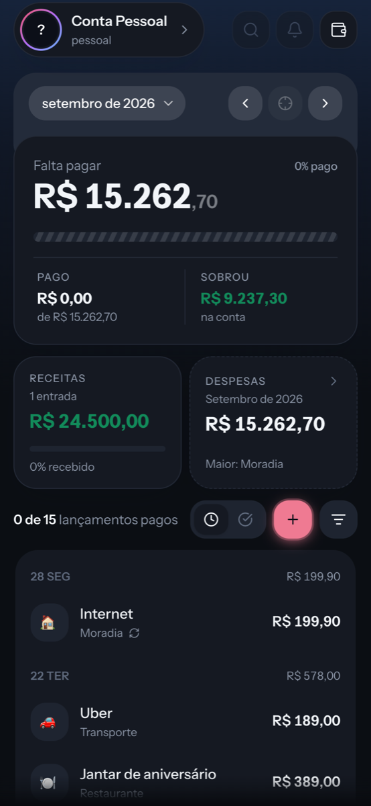
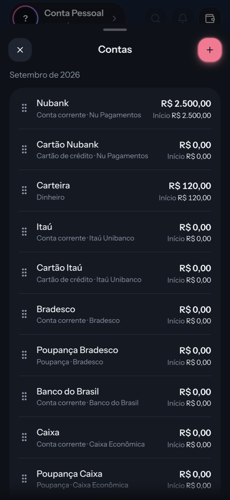

# Conta Gorda

> This month there will be money left over. Trust me.

Personal finance for one question: **what is still left to pay this month?**
You enter what comes in and what goes out, tick off what you have paid, and the
app tells you how much remains and whether the account can cover it.

Mobile-first PWA today, native iOS later, both against one Rails API.

<p align="center">
  
  
  
</p>

## Table of contents

- [What it does](#what-it-does)
- [How it is built](#how-it-is-built)
- [Repository layout](#repository-layout)
- [Running it](#running-it)
- [Mock mode](#mock-mode)
- [Tests](#tests)
- [Authentication](#authentication)
- [API](#api)
- [Conventions](#conventions)
- [Decisions and plans](#decisions-and-plans)

## What it does

- **One month at a time.** The home screen is the month: what is left to pay,
  how much of the income has landed, how much has been spent and what remains
  in the account. Swipe between months or jump back to today.
- **Transactions, in and out.** Expenses and income share one list, grouped by
  day, with a category, an account and a status. Search, sort and filter by
  pending or paid.
- **Tick it off.** Marking a transaction as paid is one tap. That is the whole
  loop: the "left to pay" figure drops as you go through the month.
- **Recurrence.** A rent or a salary is a series. Edit or delete "this one",
  "this and the next ones" or "all", the way a calendar does.
- **Accounts.** Bank accounts, cards, cash and savings, each with an opening
  balance per month. Reorder them by drag.
- **Categories** with an emoji, yours to create and rename.
- **Spending over time.** Five months side by side, the difference against last
  month in plain words, and the list filtered by category.
- **Shared ledgers.** A ledger is the unit everything belongs to. Invite
  someone by link and both of you see the same month.
- **Installable.** Home-screen icon, standalone window, safe areas, sheets with
  native-feeling gestures, dark and light theme. Last known figures show
  instantly on open while the refetch happens behind them.

Everything the user reads is pt-BR. Everything in the code is English. See
[CLAUDE.md](CLAUDE.md) for where that line is drawn.

## How it is built

| Layer | Choice | Why |
|---|---|---|
| PWA | Vite + React 19 + TypeScript, Tailwind 4, TanStack Query, react-router | A fully authenticated app gains nothing from SSR. Static, deploys to Cloudflare Pages. |
| API | Rails 8, API-only | One contract serves the PWA and the iOS app. |
| Database | Postgres 18, UUIDv7 primary keys | Time-ordered keys that never leak a sequence. |
| Auth | [Clowk](https://clowk.in), RS256 + JWKS | The API verifies tokens, it never issues them. |
| Money | `amount_cents` integer, direction in `kind` | No floats, no negative amounts, no report that forgets an `abs`. |
| Recurrence | series + materialised occurrences | "All future ones" is a `WHERE date >= today`. |
| Deploy | Cloudflare Pages (PWA), voodu on a VM (API) | Static front for free, one small VM for the rest. |

The PWA talks to the API through a thin `services` layer with two
implementations behind the same interface: the HTTP client and an in-memory
mock with fixtures. Screens and UI tests are built against the mock, which is
how a screen can be finished before its endpoint exists.

## Repository layout

```
apps/
  pwa/      Vite + React + TypeScript (installable PWA)
  rapi/     Rails 8, API-only
  ios/      SwiftUI (phase 2)
packages/   Shared TypeScript: API client, domain rules
infra/      voodu manifests
docs/
  plans/        architecture and planning notes
  decisions/    ADRs
  api/          endpoints.md — the contract both clients follow
  screenshots/  the images above
tools/      dev scripts
```

`pnpm-workspace.yaml` covers the JavaScript side only. `apps/rapi` has its own
`Gemfile` and `apps/ios` will have its own Xcode project. A polyglot monorepo is
held together by convention, not by forcing one package manager over all of it.

## Running it

Requirements: Docker, Node with pnpm, Ruby, `overmind` (`brew install overmind`).

```sh
cp apps/rapi/.env.example apps/rapi/.env   # fill in the Clowk keys
cp apps/pwa/.env.example apps/pwa/.env     # publishable key only
make setup                                 # postgres + deps + databases
make up-with-logs                          # api :3000 + pwa :5173, logs interleaved
```

`up-with-logs` runs Postgres in compose and the two apps on the host through
overmind. Ctrl-C stops the API and the PWA and leaves Postgres running, since it
holds the data you are working against. `make down` stops that too.

`make up` brings up only the database, for when you would rather run the
servers yourself.

The PWA answers on `http://localhost:5173`, not `127.0.0.1:5173`. Vite binds
IPv6 only, so the v4 address refuses the connection.

Postgres runs in compose and **must be 18**. Primary keys default to
`uuidv7()`, which arrived in that version. It listens on 5433 so it does not
collide with a Postgres you already run on 5432.

### On a phone

Both servers bind `0.0.0.0`, so a phone on the same network can open the LAN
address. That address is not a secure context, though, and the browser drops
`navigator.share`, the clipboard and `crypto.randomUUID` without a word.
`make tunnel` hands out an https URL through cloudflared. The URL changes on
every run, so reinstall the PWA after starting a new one.

## Mock mode

```sh
VITE_USE_MOCK=true pnpm dev
```

Runs the PWA on fixtures: no Rails, no Postgres. Create, edit and delete work
against an in-memory store with a small artificial latency, so loading and
empty states render the way they will against the API. Sign-in still goes
through Clowk. The UI tests always run in this mode.

## Tests

```sh
make test                       # every app
make test-rapi                  # one app
make check                      # lint + typecheck + test, what CI runs
```

Each app under `apps/` owns a Makefile exposing the same verbs, and the root
only fans out to them. Apps are discovered by wildcard rather than listed, so
adding `apps/ios` joins `make test` by having a Makefile.

Inside the API:

```sh
cd apps/rapi
make test                       # plain rspec, single process
make test-turbo                 # parallel, what CI runs
make test-one SPEC=spec/models/transaction_spec.rb
```

**Locally the suite runs in one process.** At this size, spinning up worker
databases costs more than the parallelism saves, and a single process keeps
`binding.irb` usable. `maintain_test_schema!` keeps the test database in sync
after a migration, so there is no prepare step to remember.

**CI runs it in parallel**, through
[rspec-turbo](https://github.com/thadeu/rspec-turbo). Runners bill wall-clock
time, so splitting the suite is what keeps the bill down. It balances by actual
example count from a single `--dry-run` rather than by file, so one fat spec
file cannot leave a worker idle while another grinds. Worker databases are
created and schema-loaded automatically, cached against a fingerprint of
`db/schema.rb` and `db/seeds.rb`; force it with `RSPEC_TURBO_FORCE_SETUP=1`.

`database.yml` appends `TEST_ENV_NUMBER` to the test database name, so worker 2
gets `contagorda_test2` and workers never share data. The variable is empty for
a plain `rspec` run, which is why both paths work off the same config.

Worth knowing: a spec that depends on global state, a fixed id, a shared row,
its position in the file, passes locally and fails in CI. Reach for
`make test-turbo` before pushing when a spec looks order-sensitive.

## Authentication

Auth is brokered by [Clowk](https://clowk.in). The API verifies tokens against
Clowk's published keys (RS256/JWKS) and checks the `aud` claim; it never issues
tokens. The PWA holds the access token in memory and a rotating refresh token in
storage, so a reload does not sign the user out.

Nothing here needs Clowk's signing secret. `CLOWK_SECRET_KEY` is only used for
server-to-server calls to the Clowk API.

## API

The contract lives in [`docs/api/endpoints.md`](docs/api/endpoints.md). All
routes sit under `/api/v1`.

| Resource | What it is |
|---|---|
| `me` | The current user and their preferences |
| `ledgers`, `members`, `invites` | The unit everything belongs to, who is in it, and how they got in |
| `accounts`, `opening_balances` | Where money sits, and what it started the month with |
| `categories` | Yours to create, rename and delete |
| `transactions`, `settlement`, `recurrence` | Entries, ticking one as paid, turning one into a series |
| `months`, `monthly_totals` | Which months exist, and the numbers the cards and the chart show |

Every request below `ledgers` carries an `X-Ledger-Id` header. The ledger is a
header and not a path segment on purpose: nothing in the app takes a ledger as
an argument, so no screen can pass the wrong one.

## Conventions

- **Money is `amount_cents`, an integer.** Never a float.
- **Direction comes from the `kind` column**, never from a negative amount.
  `amount_cents` is always positive, so no report can forget an `abs`.
- **Every primary key is a UUIDv7**, generated by Postgres (`default: -> {
  "uuidv7()" }`). Time-ordered, so rows insert in roughly key order instead of
  scattering across the index, and never a guessable sequential id crossing the
  API boundary.
- **Every query is scoped through the current user** (`current_user.transactions`,
  not `Transaction.find`). Defence in depth against IDOR: unguessable ids are
  not the defence, the scope is.
- **Code in English, screen in pt-BR.** Routes count as code.

## Decisions and plans

- [Architecture, stack and infra plan](docs/plans/0001-arquitetura-e-stack.md)
- [ADR 0001: recurrence dates are computed from the anchor, never chained](docs/decisions/0001-recurrence-dates.md)
- [ADR 0002: what only the server may create](docs/decisions/0002-server-minted-secrets.md)
- [ADR 0003: sheets and gestures in an installed PWA](docs/decisions/0003-sheet-gestures-on-ios.md)
